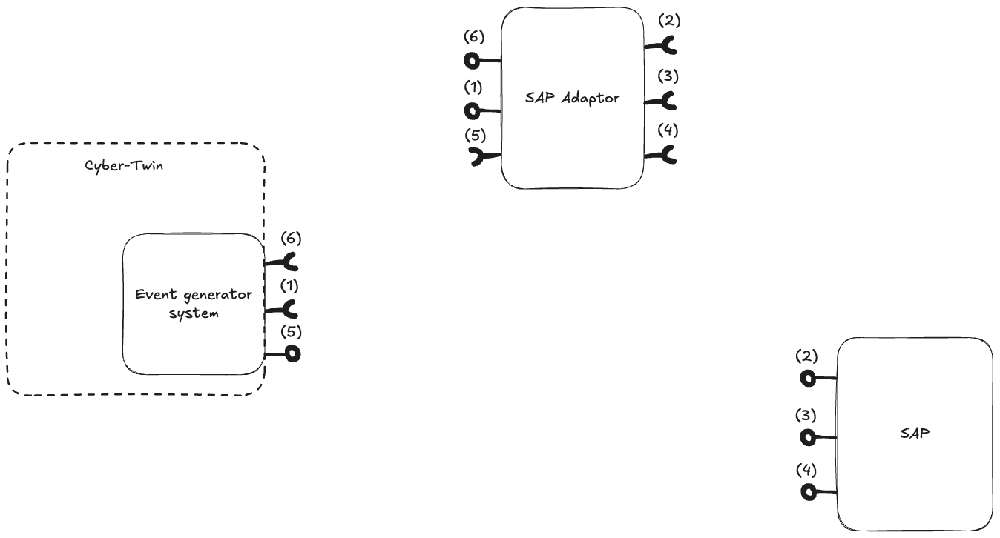

### Architecture

#### Services
- Maintenance order event (1)
- SAP Maintenance Notification(2) 
- SAP Create Maintenance Order (3)
- SAP Query Maintenance Order (4)
- Maintenance Done Event (5) (Push)
- Maintenance order query (6)
#### Systems
1. Event Generator system
	- ##### Produces:
		- (5) Maintenance done push event
	- ##### Consumes:
		- (1) Maintenance order event
		- (6) Maintenance order query
2. SAP Adaptor
	- ##### Produces
		- (1) Maintenance order event
		- (6) Maintenance order query
	- ##### Consumes
		- (5) Maintenance done push event
		- (2) SAP Maintenance Notification
		- (3) SAP Create Maintenance Order
		- (4) SAP Query Maintenance Order
3. SAP
	- ##### Produces
		- (2) SAP Maintenance Notification
		- (3) SAP Create Maintenance Order
		- (4) SAP Query Maintenance Order