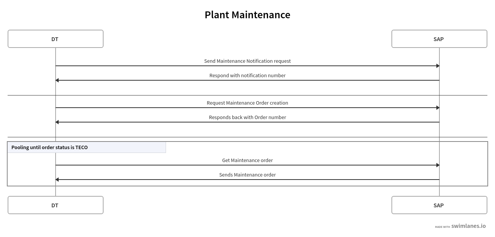
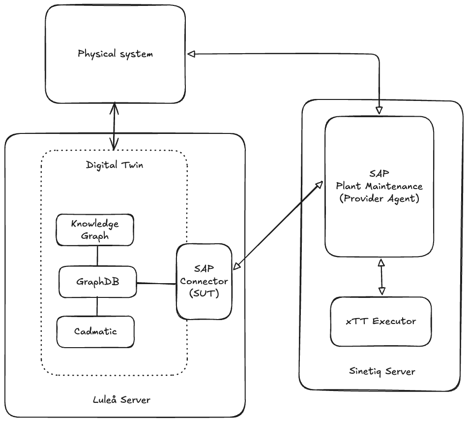

Maintenance notifications vs Maintenance orders
- A notification is to say to SAP "Something is wrong". An operator can act on the notification to create an order. One can also configure SAP to automatically create orders from every notification. 
- An order is the execution object. It holds the operation, costs, materials, scheduling, and what technicians needs to do. 
	- If the digital twin contains all this information, then we can create the order directly. 
	- Usually both are created (even if you have all the information to create the order directly)

---
### Workflow And Architecture



1. Request a Maintenance notification 
2. Get the notification number from SAP
3. Create a Order creation request, adding the notification number from the previous stage
4. Save the Order number from the response
5. Get order using interface and check that the status is completed 



### Tasks and Estimations

| Task                                                  | Interfaces involved   | Estimation |
| ----------------------------------------------------- | --------------------- | ---------- |
| SAP Interface description and request bodies examples | SAP Plant Maintenance |            |
| Documentation of consumer behavior                    | SAP Plant Maintenance |            |
| Provider response examples                            | SAP Plant Maintenance |            |
| GraphDB SPARQL interface consumer                     | SPARQL Interface      |            |
| Interface to Cadmatic?                                | Cadmatic API          |            |


#### Requests
##### For order creation
Usual business request (creating an order)
POST `/API_MAINTENANCE_ORDER/A_MaintenanceOrder`
```
{
  "MaintenanceOrderType": "PM01",
  "Description": "Replace pump seal due to leakage",
  "Equipment": "10000045",
  "FunctionalLocation": "FL100-200-300",
  "Plant": "1000",
  "MaintenancePlanningPlant": "1000",
  "Priority": "3",
  "MaintOrdBasicStartDateTime": "2025-08-21T08:00:00Z",
  "MaintOrdBasicEndDateTime": "2025-08-21T16:00:00Z",
  "MaintenanceNotification" : "200000123",
  "to_MaintenanceOrderOperation": [
    {
      "OperationText": "Disassemble pump",
      "WorkCenter": "PUMP-WC01",
      "Plant": "1000",
      "OperationControlKey": "PM01",
      "OperationStandardDuration": "4",
      "OperationDurationUnit": "H"
    },
    {
      "OperationText": "Replace seal and test",
      "WorkCenter": "PUMP-WC01",
      "Plant": "1000",
      "OperationControlKey": "PM01",
      "OperationStandardDuration": "2",
      "OperationDurationUnit": "H"
    }
  ]
}
```

The bare minimum would looks something like this:
```
{
  "MaintenanceOrderType": "PM01",
  "Description": "Auto-created order from digital twin",
  "Equipment": "10000045",
  "Plant": "1000"
}
```

##### For notifications
```
{
  "NotificationType": "M1",
  "Description": "Pump showing abnormal vibration",
  "Equipment": "10000045",
  "FunctionalLocation": "FL100-200-300",
  "Plant": "1000",
  "Priority": "3"
}
```
##### Get Order
`GET /sap/opu/odata/sap/API_MAINTENANCE_ORDER/A_MaintenanceOrder('400000789')?$expand=to_MaintenanceOrderOperation`

---
#### Responses
##### Order creation
```
{
  "d": {
    "MaintenanceOrder": "400000789",              // SAP-generated order number
    "MaintenanceOrderType": "PM01",
    "Description": "Replace pump seal due to leakage",
    "Equipment": "10000045",
    "Plant": "1000",
    "OrderStatus": "CRTD",                       // Created
    "MaintOrdBasicStartDateTime": null,
    "MaintOrdBasicEndDateTime": null,
    "MaintenanceNotification" : "200000123",
    "__metadata": {
      "id": ".../A_MaintenanceOrder('400000789')",
      "uri": ".../A_MaintenanceOrder('400000789')",
      "type": "API_MAINTENANCE_ORDER.A_MaintenanceOrderType"
    },
    "to_MaintenanceOrderOperation": {
      "results": [
        {
          "MaintenanceOrder": "400000789",
          "MaintenanceOrderOperation": "0010",    // SAP-assigned operation number
          "OperationText": "Disassemble pump",
          "WorkCenter": "PUMP-WC01",
          "OperationControlKey": "PM01",
          "OperationStandardDuration": "4",
          "OperationDurationUnit": "H",
          "__metadata": {
            "id": ".../A_MaintenanceOrderOperation(MaintenanceOrder='400000789',MaintenanceOrderOperation='0010')",
            "uri": ".../A_MaintenanceOrderOperation(MaintenanceOrder='400000789',MaintenanceOrderOperation='0010')",
            "type": "API_MAINTENANCE_ORDER.A_MaintenanceOrderOperationType"
          }
        }
      ]
    }
  }
}
```

##### Notification
```
{
  "d": {
    "Notification": "200000123",
    "Description": "Pump showing abnormal vibration",
    "Plant": "1000"
  }
}
```
##### Get Order
```
{
  "d": {
    "MaintenanceOrder": "400000789",
    "Description": "Correct vibration issue in pump",
    "Equipment": "10000045",
    "Plant": "1000",
    "MaintenanceNotification": "200000123",
    "OrderStatus": "TECO",              // Status (CRTD, REL, TECO, CLSD, etc.)
    "MaintOrdBasicStartDateTime": "2025-08-21T08:00:00Z",
    "MaintOrdBasicEndDateTime": "2025-08-21T16:00:00Z",
    "to_MaintenanceOrderOperation": {
      "results": [
        {
          "MaintenanceOrderOperation": "0010",
          "OperationText": "Inspect bearings and shaft",
          "OperationStatus": "CNF",     // Operation confirmed
          "ActualWorkQuantity": "2.0",
          "WorkQuantityUnit": "H"
        }
      ]
    }
  }
}
```

