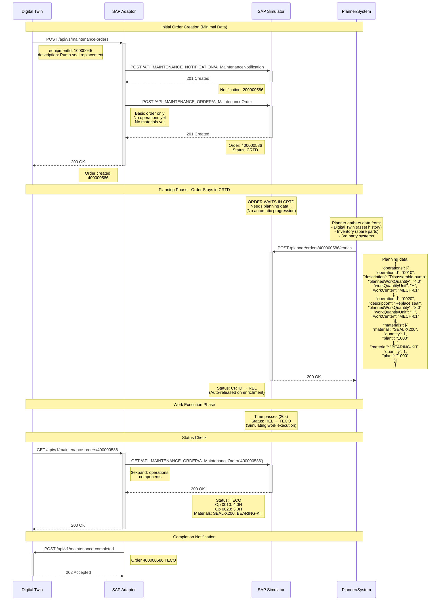

# Planning Enrichment Flow

API draft: [`../api/openapi-planner-simulator.yaml`](../api/openapi-planner-simulator.yaml)

The draft only exposes the planner enrichment operation:
`POST /planner/orders/{maintenanceOrder}/enrich`. The payload is simplified for
planner use, while keeping SAP-oriented field names for operations, components,
planned work, and optional actual work.

## Simulator Mode
```bash
./sap-simulator --planner-input=required
```

## Process Flow


